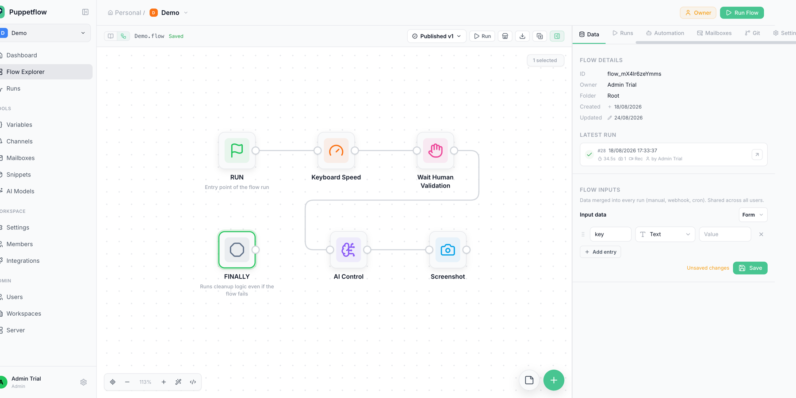
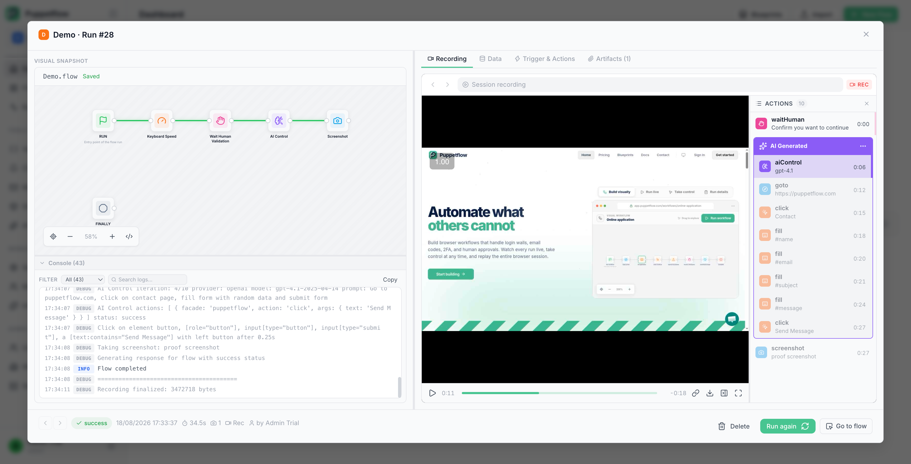
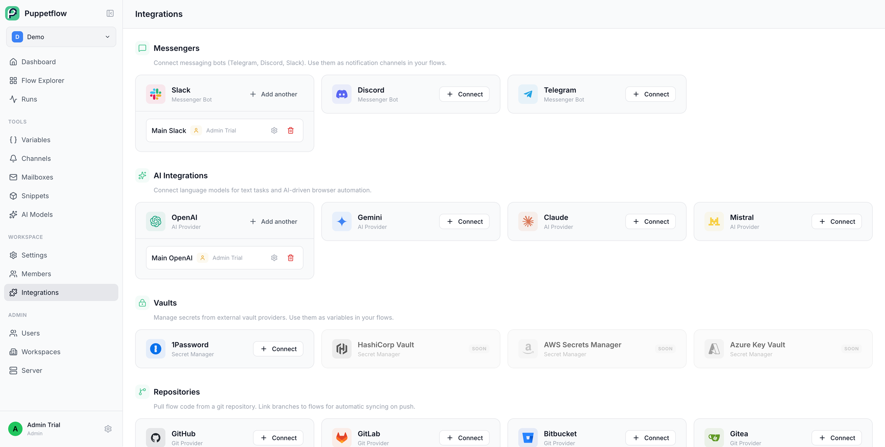
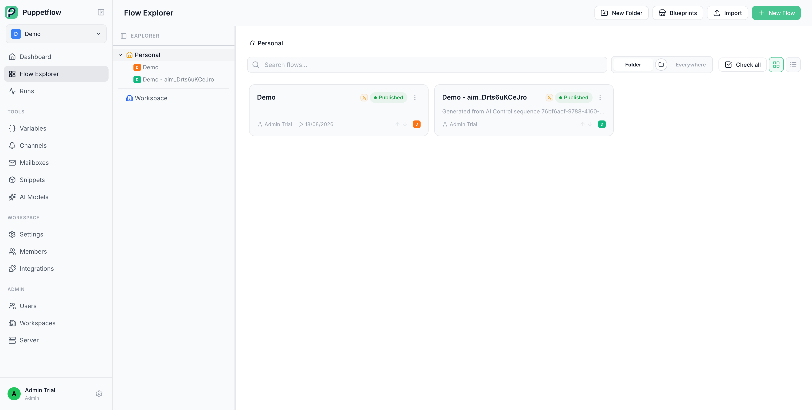
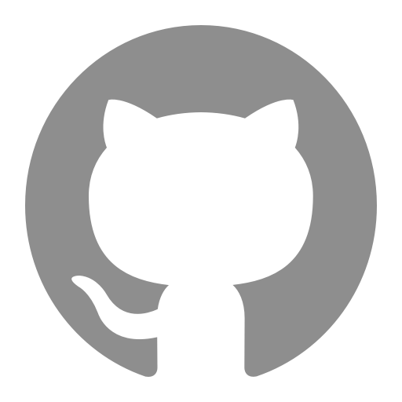

# Puppetflow

Puppetflow is a self-hosted browser automation platform for writing, running, scheduling, and monitoring JavaScript workflows. Watch browser sessions live and take control whenever a run needs human attention.

   

⭐️ Like Puppetflow? Give the repository a star. It helps others discover the project.

  <h3>Install Puppetflow in seconds</h3>
  
<code>curl -fsSL https://puppetflow.com/install.sh | bash</code>

---

## Puppetflow in action

  
   
  
   
  
   
  

## 🌐 Website and documentation

- Website: [puppetflow.com](https://puppetflow.com)
- Video: [Puppetflow in 100 seconds](https://www.youtube.com/watch?v=0TNsKNjcg6U)
- Documentation: [docs.puppetflow.com](https://docs.puppetflow.com)
- Self-hosting guide: [Install or update Puppetflow](https://docs.puppetflow.com/self-hosting/installation)

## 🎉 Features

- Build browser workflows in JavaScript
- Run workflows manually, on a schedule, or through integrations
- Watch browser sessions live and take control when needed
- Organize flows and reusable snippets in workspaces
- Manage variables, secrets, and browser profiles
- Inspect run history, logs, and execution results
- Connect repositories and external vaults like 1Password
- Integrate with messaging tools and mailboxes
- Deploy on your own infrastructure with Docker
- Extend Puppetflow with reusable flows and snippets

## 🔗 n8n integration

Puppetflow provides the [`n8n-nodes-puppetflow`](https://www.npmjs.com/package/n8n-nodes-puppetflow) community node for adding browser automation to n8n workflows.

- Trigger a flow with optional JSON input.
- List and monitor runs, then retrieve their results.
- Download screenshots, files, and session recordings.

Install the package from **Settings > Community Nodes** on a self-hosted n8n instance, then connect it with your Puppetflow instance URL and an API key from **Profile > API Keys**. See the [n8n integration guide](https://docs.puppetflow.com/guide/integrations#n8n) for setup details.

## 🛟 Discussion / Need help?

### Join our Discord

### Open an Issue

## Project philosophy

Puppetflow is built around a few straightforward ideas:

- Browser automation should remain understandable and debuggable.
- Self-hosting should be a real option, not an afterthought.
- Good defaults matter, but users should keep control of their data and infrastructure.
- Reliability and maintainability matter more than shipping a long list of half-finished features.

## A note on project history

The public Git history was intentionally reset for the Community Edition release for security reasons. This repository's commit count therefore does not reflect the age or maturity of the project.

Puppetflow has been developed and operated in real conditions for nearly a year. The Community Edition is a publication of an existing product, not the beginning of a prototype.

## No AI Slop Policy

Puppetflow does not accept low-effort, unreviewed generated code or content.

AI-assisted work is not banned. Submitting output that the contributor does not understand, has not checked, or cannot maintain is. Contributions must be deliberate, consistent with the existing codebase, and owned by the person submitting them.

See [Contributing](docs/CONTRIBUTING.md) for the practical rules.

## Repository documentation

- [Install or update a self-hosted instance](docs/INSTALL.md)
- [Set up a development environment and contribute](docs/CONTRIBUTING.md)
- [Source available license](LICENSE.md)
- [Proprietary features license](LICENSE_PROPRIETARY.md)

## License

Puppetflow is source available. Most of the code is licensed under the [Puppetflow Source Available License](LICENSE.md), which permits personal, non-commercial use. Internal business use requires a current paid Puppetflow subscription or order.

Files under `proprietary/`, files containing the `.pp.` marker, and explicitly marked code blocks implement paid features. They are covered by the [Puppetflow Proprietary License](LICENSE_PROPRIETARY.md), and their use in production requires a valid Puppetflow subscription.
